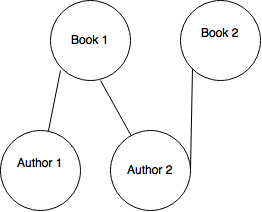

# gaegraph

Gaegraph is a lib to simplify creating relationships in Google App Engine Datastore. It uses [Graph Theory](https://en.wikipedia.org/wiki/Graph_theory) to model a NoSQL database, with Arcs (relationship in SQL) between Nodes (documents in NoSQL, tables in SQL).

## Example


An user can be the author of many books and a book can have many authors. Let's create this n x n relationship using Gaegraph.

```python
from gaegraph.model import Node, Arc
from google.appengine.ext import ndb


class Book(Node):
    title = ndb.StringProperty(required=True)

class Author(Node):
    name = ndb.StringProperty(required=True)

class AuthorArc(Arc):
    origin = ndb.KeyProperty(Author)
    destination = ndb.KeyProperty(Book)
```

## Instalation

First, you need to have installed [Google App Engine SDK](https://cloud.google.com/appengine/downloads) for Python. 
Make sure you have google_appengine directory in your PATH.

```
export GAE_SDK=/path/to/google_appengine/
PATH=$PATH:$GAE_SDK
```

Then, you can install gaegraph using pip.

```
pip instal gaegraph
```

## Contributing

Create a virtual enviroment and install the required libs.

```
virtualenv venv --python=python2
source venv/bin/activate
pip install -r venv/requirements.txt
```

## Tests

After following the "Contributing" instructions, run the testloader script.

```
python tests/testloader.py
```

## Graph Theory

Interested in knowing more about Graphs?

- [Graphs in Python](http://www.python-course.eu/graphs_python.php)
- [Python Patterns - Implementing Graphs](https://www.python.org/doc/essays/graphs/)
- [Graph Database](https://en.wikipedia.org/wiki/Graph_database)
- [World of Mathematics - Graph Theory](http://world.mathigon.org/Graph_Theory)
